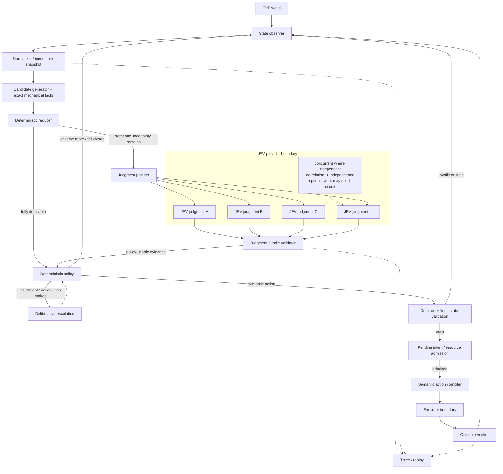

# JEVe

JEVe is a reference architecture for low-latency decision systems in EVE Online.

The central idea is:

> **Use deterministic code for facts, constraints, state machines, and final action policy; use JEV for the semantic uncertainty that deterministic code cannot resolve cheaply.**

JEVe is intentionally an architecture-and-contract repository rather than a finished automation implementation. The documents are meant to be detailed enough that a human or an AI coding agent can expand the design into an MVP without first rediscovering the major boundaries.

## Core idea

The primary JEVe fast path is not "ask a model what action to take".

Instead, decompose the unresolved semantics into small typed judgments, evaluate independent judgments in parallel, then let ordinary deterministic code combine those judgments with known state and constraints.

```text
World state
  -> deterministic normalization
  -> exact facts / constraints / candidate space
  -> unresolved semantic dimensions
  -> decomposed JEV judgments, preferably in parallel
  -> validated probabilistic semantic evidence
  -> deterministic action policy
  -> fresh-state validation
  -> semantic-action compilation
  -> execution
  -> outcome verification
  -> new world state
```

A typical JEV interaction therefore looks more like:

```text
structured state
      |
      +--> hostile_probability --------+
      +--> route_a_risk ---------------+
      +--> route_b_risk ---------------+--> JudgmentBundle
      +--> disengage_probability ------+
      +--> target_preference ----------+
                                          |
                                          v
                               DeterministicPolicy
                                          |
                                          v
                                       RETREAT
```

rather than:

```text
candidate A / B / C
        |
        v
       JEV
        |
        v
selected_candidate = B
```

Closed-candidate selection is still supported as a bounded compatibility mode when decomposition would add no value, but it is no longer the conceptual center of JEVe.

## Authority boundary

The strongest invariant is:

```text
probabilistic judgment != action authority
```

JEV may produce semantic evidence such as:

```text
hostile_probability = 0.84
route_a_risk = 0.73
route_b_risk = 0.31
disengage_probability = 0.78
target_preference = target_3
```

but a deterministic policy owns the actual branch:

```text
DeterministicPolicy(
    fresh_state,
    hard_constraints,
    valid_candidates,
    judgment_bundle
) -> SemanticAction
```

This makes the existing JEVe rule stronger:

> **No probabilistic judgment creates physical authority.**

The probabilistic layer contributes evidence. Deterministic code decides whether that evidence is sufficient, comparable, fresh, policy-compliant, and safe enough to justify a semantic action.

## Architecture



The architecture remains a **deterministic -> probabilistic evidence -> deterministic** sandwich:

1. **Before JEV:** normalize observations, calculate exact values, enforce hard constraints, remove impossible actions, and identify only the semantic questions that remain unresolved.
2. **At JEV:** evaluate small typed judgment questions. Independent questions should be evaluated concurrently when the provider/runtime permits it.
3. **After JEV:** validate the returned judgment bundle, combine it with known state through deterministic policy, reject stale or insufficient evidence, and only then produce a semantic action.
4. **Before physical execution:** revalidate the chosen semantic action against fresh state and compile it into an implementation-specific execution plan.

## Why this can be fast

The fastest model call is the one that is unnecessary. The second-fastest path is a small set of independent judgments that can run concurrently.

JEVe therefore optimizes in this order:

- resolve exact questions mechanically;
- eliminate impossible or dominated actions mechanically;
- identify only unresolved semantic dimensions;
- project only the features needed by each judgment;
- evaluate independent judgments in parallel;
- allow deterministic policy to proceed as soon as its required evidence set is complete;
- cancel optional or stale work when a newer snapshot supersedes it;
- keep physical actuation outside model execution so cognition can run faster than mutation.

For example, instead of sending a large state blob and asking for one answer, JEVe may issue four small independent questions:

```text
Q1: probability current contact is hostile
Q2: semantic risk of route A
Q3: semantic risk of route B
Q4: probability current situation warrants disengagement
```

If they are independent, wall-clock cost approaches the slowest required judgment rather than the sum of all four latencies.

## Judgment values are typed evidence

A numeric model output is not automatically a calibrated probability.

JEVe therefore requires judgment output semantics to be explicit, for example:

```text
PROBABILITY
SCORE
BOOLEAN
ENUM
RANKING
DISTRIBUTION
```

and, where relevant, calibration metadata should distinguish:

```text
CALIBRATED
UNCALIBRATED
UNKNOWN
```

Deterministic policy must not silently compare values with incompatible meaning. A `0.8` uncalibrated preference score and a `0.8` calibrated probability are not interchangeable.

## State is not just true or false

EVE is partially observable and changes while cognition is running. JEVe treats uncertainty and staleness as first-class state.

A fact may be:

```text
KNOWN_TRUE
KNOWN_FALSE
UNKNOWN
STALE
TRANSITIONAL
```

`UNKNOWN` must never silently become `false`.

Judgments are also bound to the snapshot and observation epoch that produced their input. If the relevant world changes before deterministic policy or execution can safely consume them, the bundle is revalidated, partially recomputed, or discarded.

## Semantic actions vs physical actions

The deterministic action policy emits domain-level actions such as:

```text
WAIT
CONTINUE_ROUTE
TAKE_ALTERNATE_ROUTE
DOCK
RETREAT
ENGAGE_TARGET(target_id)
INVESTIGATE(object_id)
```

Neither JEV judgments nor semantic policy output contain mouse coordinates, key presses, window handles, or stale UI references.

The semantic action is later compiled through a separate boundary:

```text
SemanticAction
  -> verify fresh preconditions
  -> resolve current target/control
  -> produce an execution plan
  -> issue bounded input
  -> verify command acceptance
  -> verify progress when applicable
  -> verify final effect
```

## Decision layers

JEVe separates four different jobs that are easy to conflate:

| Layer | Purpose | Examples |
|---|---|---|
| Mechanical state | Things code can prove or calculate | legality, reachability, distance, capacity, timers, exact state-machine constraints |
| JEV judgment | Semantic evidence that is expensive or awkward to encode exactly | threat probability, contextual risk, preference, disengagement likelihood |
| Deterministic policy | Combines exact state + constraints + judgments into an action | thresholding, weighted policy, rule table, state machine, utility branch |
| Deliberative path | Novel, long-horizon, underspecified, or high-stakes reasoning | new plan generation, conflicting objectives, deciding what new evidence is required |

This separation matters because a JEV result can be useful even when it does not directly name an action.

## Closed-candidate selector mode

JEVe still permits a bounded selector mode:

```text
CandidatePreferenceRequest(A, B, C)
  -> preference / ranking / selected candidate
```

Use it when the semantic question really is irreducibly "which of these alternatives is preferable?" and decomposition would only recreate the same choice indirectly.

Even in selector mode, the result is treated as probabilistic evidence. Deterministic policy still owns:

- whether the result is acceptable;
- whether confidence/margin semantics are meaningful;
- whether the state is still fresh;
- whether a higher-priority constraint inhibits the action;
- whether to execute, deliberate, observe more, wait, or fail closed.

## Maturation direction

As a domain becomes better understood, repeated model judgments should not automatically become hard-coded rules.

The desired progression is:

```text
repeated judgment pattern
  -> evidence collection
  -> hypothesized invariant
  -> deterministic rule
  -> adversarial replay validation
  -> optional promotion into mechanical policy
```

The long-term goal is not "use more AI". It is to move stable, understood reasoning into cheaper deterministic machinery while leaving genuinely semantic uncertainty in the probabilistic layer.

## MVP scope

The architecture MVP needs only enough implementation to prove the boundary:

1. immutable normalized state snapshots;
2. deterministic candidate generation and reduction;
3. a typed `JudgmentPlan` containing independent semantic questions;
4. a replaceable JEV judgment adapter with parallel-capable execution semantics;
5. typed `JudgmentResult` and `JudgmentBundle` contracts;
6. deterministic policy that consumes state + constraints + judgments and emits a semantic action or a non-action route;
7. fresh-state validation;
8. semantic action compilation as an interface;
9. a simulated executor and outcome verifier;
10. replayable traces covering deterministic-only, judgment-driven, partial-bundle, stale-bundle, escalation, and fail-closed paths.

No particular JEV transport, EVE observation mechanism, programming language, or physical input mechanism is required by the architecture.

## Documents

Read in this order when implementing or extending JEVe:

1. [`docs/ARCHITECTURE.md`](docs/ARCHITECTURE.md) — normative component boundaries and invariants.
2. [`docs/JEV_JUDGMENT_MODEL.md`](docs/JEV_JUDGMENT_MODEL.md) — decomposition, parallel judgment, bundle semantics, and policy composition.
3. [`docs/DETAILED_DESIGN.md`](docs/DETAILED_DESIGN.md) — implementation-ready contracts, routing, lifecycle, failure handling, and suggested module structure.
4. [`docs/MVP_PLAN.md`](docs/MVP_PLAN.md) — smallest useful implementation and acceptance criteria.
5. [`docs/CLEAN_ROOM.md`](docs/CLEAN_ROOM.md) — independent implementation boundaries.
6. [`AGENTS.md`](AGENTS.md) — concise instructions for AI coding agents.

## Non-goals

JEVe does not prescribe:

- a specific EVE input mechanism;
- a specific UI parser or telemetry source;
- a specific JEV implementation or provider;
- treating uncalibrated scores as objective probabilities;
- a monolithic autonomous agent;
- hidden fallback from semantic uncertainty to blind physical input;
- copying implementation details from an unrelated repository.

## Design principle in one sentence

> **Mechanically establish what can be known exactly, ask JEV only for the unresolved semantic evidence, combine that evidence with deterministic policy, then revalidate and execute through a separate verified control path.**
