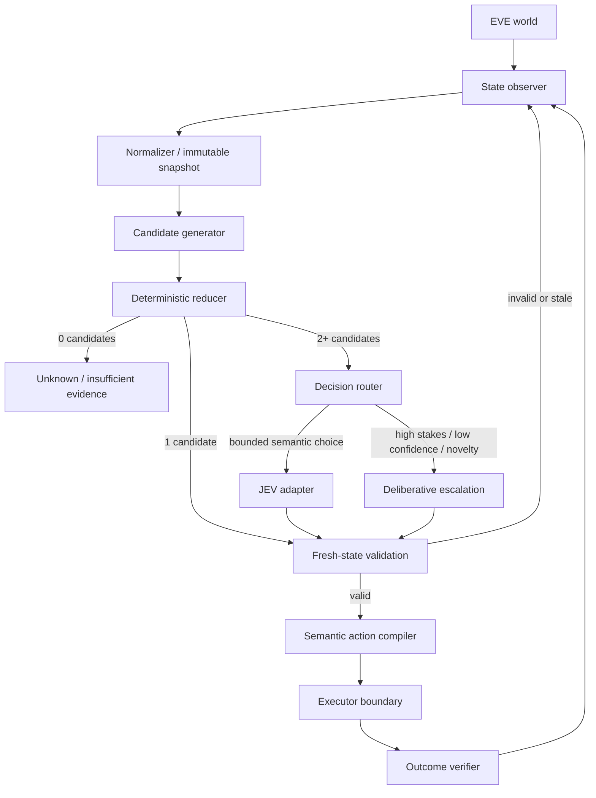

# JEVe

JEVe is a reference architecture for low-latency decision systems in EVE Online.

The central idea is simple: **do not ask an AI model to decide what deterministic code can already decide**. Reduce the world state mechanically first, invoke JEV only for the remaining semantic ambiguity, then re-enter a deterministic path for validation and execution.

JEVe is intentionally an architecture-and-contract repository rather than a finished automation implementation. It is meant to provide enough structure that a human or an AI coding agent can build an MVP without having to rediscover the core boundaries.

## Core idea

Treat decision making as a pipeline:

```text
World state
  -> deterministic normalization
  -> candidate generation
  -> deterministic reduction
  -> JEV only when ambiguity remains
  -> fresh-state validation
  -> semantic-action compilation
  -> execution
  -> outcome verification
  -> new world state
```

For state `S_t` and possible actions `A(S_t)`:

```text
A0 = A(S_t)
A1 = rule_filter(A0)
A2 = deterministic_reduce(A1)

if |A2| == 0: fail closed / request more observation
if |A2| == 1: select A2[0] without JEV
if |A2| > 1:  ask JEV to select only from A2
```

The important boundary is:

```text
JEV may choose among valid semantic actions.
JEV does not gain authority to invent or directly execute physical actions.
```

This keeps the probabilistic part small, bounded, replaceable, observable, and fast.

## Architecture



The architecture is a **deterministic -> semantic -> deterministic sandwich**:

1. **Before JEV:** normalize observations, reject impossible actions, calculate known quantities, remove dominated choices, and decide mechanically whenever possible.
2. **At JEV:** present a compact structured decision with a closed candidate set. JEV performs semantic selection, not UI manipulation.
3. **After JEV:** reject stale decisions, re-check preconditions, compile the semantic action into an implementation-specific execution plan, and verify the result from observation.

## Why this can be fast

The latency-sensitive path is kept deliberately narrow.

- Do not send raw UI state to JEV when normalized features are enough.
- Do not ask JEV to enumerate actions when code can enumerate them.
- Do not invoke JEV when deterministic reduction leaves one answer.
- Keep the candidate set small and typed.
- Reuse derived state within the same observation epoch.
- Route uncertain or high-consequence decisions to a slower deliberative path rather than making every decision slow.
- Keep physical actuation out of the model call, so reasoning latency and input timing are independent.

A useful routing function is conceptually:

```text
route = f(
  candidate_count,
  confidence,
  top_two_margin,
  stakes,
  novelty,
  state_freshness,
  latency_budget
)
```

This is a routing policy, not a rule that JEV should decide for itself.

## State is not just true or false

EVE is partially observable and changes while a decision is being computed. JEVe therefore treats uncertainty and staleness as first-class state.

A field may be:

```text
KNOWN_TRUE
KNOWN_FALSE
UNKNOWN
STALE
TRANSITIONAL
```

`UNKNOWN` must never silently become `false`. A decision also belongs to the observation epoch that produced its evidence. If the relevant epoch changes before execution, the decision must be revalidated or discarded.

## Semantic actions vs physical actions

JEV should work with domain-level actions such as:

```text
WAIT
CONTINUE_ROUTE
TAKE_ALTERNATE_ROUTE
DOCK
RETREAT
ENGAGE_TARGET(target_id)
INVESTIGATE(object_id)
```

It should not return mouse coordinates, key presses, window handles, or UI traversal steps.

The semantic action is later compiled by an implementation-specific adapter:

```text
SemanticAction
  -> verify preconditions
  -> resolve current target/control
  -> produce an execution plan
  -> issue bounded input
  -> verify command acceptance
  -> verify progress when applicable
  -> verify final effect
```

This separation lets the decision architecture survive changes to client layout, input transport, localization, or platform details.

## Decision tiers

JEVe assumes three decision tiers.

| Tier | Purpose | Typical examples |
|---|---|---|
| Deterministic | Things code can prove or calculate | legality, reachability, distance, capacity, timers, exact constraints, dominance elimination |
| JEV fast path | Small bounded semantic ambiguity | wait vs continue, threat interpretation, route preference under uncertain risk, target preference |
| Deliberative path | Novel, long-horizon, high-stakes, or poorly specified problems | generating a new plan, resolving conflicting objectives, requesting new observations |

As the system matures, repeated stable decisions can move downward from JEV into deterministic rules. The desired long-term direction is therefore not "use more AI", but **compile stable judgment into cheaper deterministic behavior whenever the invariant is understood**.

## MVP scope

The MVP described here does not need a full EVE automation stack. It needs only enough implementation to prove the architecture:

1. immutable normalized state snapshots;
2. candidate generation and deterministic reduction;
3. a decision router;
4. a replaceable JEV adapter;
5. a typed `DecisionRequest` / `DecisionResponse` contract;
6. fresh-state decision validation;
7. semantic action compilation as an interface;
8. an executor boundary that can initially be a simulator or stub;
9. outcome verification and replayable decision traces;
10. synthetic scenarios covering deterministic, JEV, escalation, stale-state, and fail-closed paths.

No particular JEV transport, UI automation mechanism, programming language, or EVE client integration is required by the architecture.

## Documents

Read in this order when implementing or extending JEVe:

1. [`docs/ARCHITECTURE.md`](docs/ARCHITECTURE.md) — normative component boundaries and invariants.
2. [`docs/DETAILED_DESIGN.md`](docs/DETAILED_DESIGN.md) — data contracts, decision routing, lifecycle, failure handling, and suggested module structure.
3. [`docs/MVP_PLAN.md`](docs/MVP_PLAN.md) — smallest useful implementation and acceptance criteria.
4. [`docs/CLEAN_ROOM.md`](docs/CLEAN_ROOM.md) — how to reimplement integrations without importing source-specific assumptions from other repositories.
5. [`AGENTS.md`](AGENTS.md) — concise instructions for AI coding agents working in this repository.

## Non-goals

JEVe does not prescribe:

- a specific EVE input mechanism;
- a specific UI parser or telemetry source;
- a specific JEV implementation or provider;
- a monolithic autonomous agent;
- hidden fallback from semantic uncertainty to blind physical input;
- copying implementation details from an unrelated repository.

The repository defines boundaries and invariants so those pieces can be implemented independently.

## Design principle in one sentence

> **Mechanically decide everything that can be mechanically decided; use JEV only for bounded semantic ambiguity; then return to deterministic validation and verified execution.**
