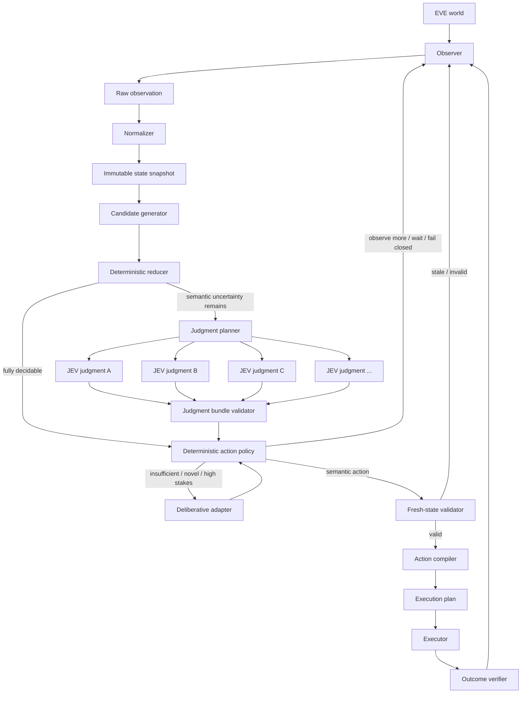

# JEVe Architecture

This document is the normative architecture description for JEVe.

JEVe separates four concerns that are often incorrectly collapsed into one agent:

1. **observation and exact mechanical interpretation**;
2. **probabilistic semantic judgment**;
3. **deterministic action policy**;
4. **validated physical execution**.

The architecture is designed so that changing the JEV implementation, the EVE observation source, the action policy, or the physical input mechanism does not require rewriting the other layers.

## 1. Architectural objective

The objective is not to maximize model usage. It is to minimize the amount of state that requires probabilistic reasoning while preserving useful semantic judgment under uncertainty.

The primary control shape is:

```text
observation
  -> normalized state
  -> exact facts / constraints / candidate space
  -> identify unresolved semantic dimensions
  -> evaluate decomposed JEV judgments
  -> validate a judgment bundle
  -> deterministic action policy
  -> fresh-state validation
  -> execution planning
  -> bounded physical action
  -> observed outcome
```

The system must preserve this invariant:

> **No probabilistic judgment creates physical authority.**

A JEV output is semantic evidence. Deterministic policy decides whether the evidence is sufficient and what semantic action, if any, follows from it. A separate fresh-state validator and compiler decide whether that semantic action may become physical execution.

## 2. Component model



The primary architecture is therefore a **deterministic -> probabilistic evidence -> deterministic** sandwich.

## 3. Observer

The Observer acquires evidence about the current EVE state.

It owns acquisition, not semantic judgment. An observer may read structured client state, an accessibility tree, a screen-derived representation, logs, or a simulator. The architecture does not require one particular source.

Observer output should carry provenance and freshness information whenever possible.

## 4. Normalizer

The Normalizer converts source-specific observations into a stable domain representation.

Responsibilities:

- canonical identifiers where available;
- units and coordinate normalization;
- explicit uncertainty;
- timestamps and observation epoch;
- source provenance;
- deterministic derived values;
- rejection of malformed or internally contradictory observations.

The Normalizer must not silently invent missing facts.

## 5. Immutable state snapshot

A decision cycle operates on a snapshot rather than a mutable bag of live values.

A snapshot must expose at least:

```text
snapshot_id
observation_epoch
state_epoch
observed_at
freshness policy
facts
objectives
constraints
provenance summary
```

The implementation may use persistent immutable structures or ordinary objects treated as immutable by contract.

## 6. Candidate generator

The Candidate Generator creates semantic actions currently supported and authorized by static domain capability.

It answers:

> "Which semantic actions are available to policy?"

It does not answer:

> "Which action should be taken?"

Candidates are typed and parameterized by semantic identifiers, not physical UI references.

Example:

```text
WAIT
CONTINUE_ROUTE(route_id)
DOCK(station_id)
RETREAT(destination_id)
ENGAGE_TARGET(entity_id)
```

Candidate generation remains useful even though JEV no longer needs to select directly from the candidate set. It gives deterministic policy a bounded action vocabulary and lets impossible actions be removed before semantic judgment is requested.

## 7. Deterministic reducer

The Deterministic Reducer removes actions that can be rejected without probabilistic semantic judgment.

Typical reducers include:

- malformed parameters;
- unavailable capability;
- failed hard preconditions;
- hard safety constraints;
- exact resource/capacity limits;
- deadline constraints;
- route reachability;
- known state-machine constraints;
- pending-intent conflicts;
- strict dominance under declared deterministic dimensions;
- explicit operator policy.

Every elimination must have a stable reason code.

If the remaining state and candidate set are sufficient for deterministic policy to choose an action, JEV should not be called.

If uncertainty remains, the unresolved dimensions are passed to the Judgment Planner rather than turning the entire state into one model prompt.

## 8. Judgment planner

The Judgment Planner is the bridge between deterministic state and probabilistic semantic evidence.

It decides **what needs to be judged**, not what action should be taken.

Inputs may include:

```text
normalized snapshot
objective
surviving candidates
unresolved semantic dimensions
policy evidence requirements
latency budget
```

Output is a `JudgmentPlan` containing typed questions such as:

```text
hostile_probability(contact_id)
route_risk(route_a)
route_risk(route_b)
should_disengage(current_context)
target_preference(target_set)
```

The planner should decompose questions when:

- outputs are semantically distinct;
- each output can use a smaller feature slice;
- outputs can be evaluated independently;
- deterministic policy can compose them afterward.

The planner must not create artificial decomposition when one judgment is genuinely dependent on another. Dependencies must be explicit.

## 9. JEV judgment adapter

The JEV adapter evaluates one or more typed semantic questions.

The primary JEVe usage model is evidence generation, not direct action authority.

A judgment request binds:

```text
question_id
snapshot_id
observation_epoch
question kind and semantic meaning
subject/context identifiers
compact feature slice
output contract
freshness/deadline metadata
```

A result may return:

```text
probability
score
boolean
categorical value
ranking
distribution
abstention / insufficient information / error
```

The output type and scale must be explicit. A numeric output without defined semantics is not safe policy input.

## 10. Parallel judgment execution

Independent judgment questions should be eligible for concurrent execution.

Example:

```text
Q1 hostile_probability(contact)
Q2 route_risk(route_a)
Q3 route_risk(route_b)
Q4 should_disengage(context)
```

If these questions do not depend on one another, wall-clock latency should be dominated by the slowest required question rather than the sum of their individual latencies.

The runtime may represent the plan as a dependency graph:

```text
wave 0: Q1 Q2 Q3 Q4
wave 1: optional follow-up questions that depend on wave 0
```

Only independent read-only cognition is parallelized by default. State-changing execution remains separately serialized or resource-controlled.

## 11. Judgment bundle validator

A `JudgmentBundle` is a correlated set of JEV results for one policy evaluation context.

The validator checks:

- result/question correlation;
- snapshot and observation-epoch binding;
- schema validity;
- output range and type;
- required result presence;
- calibration semantics where required;
- freshness;
- incompatible or contradictory result combinations when the contract defines such constraints.

A partial bundle may be valid only if policy explicitly declares which judgments are optional.

Provider failure must remain provider failure. It must not silently become a guessed value.

## 12. Judgment semantics and calibration

A number is not automatically a probability.

JEVe distinguishes at least:

```text
PROBABILITY
SCORE
BOOLEAN
ENUM
RANKING
DISTRIBUTION
```

Where applicable, the result also carries calibration status:

```text
CALIBRATED
UNCALIBRATED
UNKNOWN
```

Policy must not silently compare incompatible scales.

For example:

```text
0.82 calibrated hostile probability
```

is not semantically equivalent to:

```text
0.82 uncalibrated preference score
```

High-consequence policies may require calibrated probability semantics or may reject evidence whose calibration status is insufficient.

## 13. Deterministic action policy

The Deterministic Action Policy is the authority that converts state and evidence into a semantic branch.

Conceptually:

```text
Policy(
  StateSnapshot,
  ConstraintSet,
  SurvivingCandidateSet,
  JudgmentBundle
) -> PolicyDecision
```

A `PolicyDecision` may be:

```text
SELECT(action)
OBSERVE_MORE(required_evidence)
DELIBERATE(reason)
WAIT(reason)
FAIL_CLOSED(reason)
```

The policy may use:

- thresholds;
- rule tables;
- finite-state logic;
- deterministic utility calculations;
- configured weights;
- hysteresis;
- explicit risk budgets;
- candidate dominance after semantic scores become available.

The exact policy is domain-specific, but it must be replayable and deterministic for the same validated inputs and configuration.

### 13.1 Why policy remains deterministic

Keeping final branching in ordinary code provides:

- explicit authority;
- reproducible behavior;
- policy review without changing the JEV provider;
- independent tuning of risk thresholds;
- easier replay and regression testing;
- the ability to reject otherwise plausible judgments when hard constraints dominate.

## 14. Closed-candidate selector mode

JEVe permits a secondary selector mode for cases where the unresolved semantic problem is itself a bounded preference among known alternatives.

Example:

```text
CandidatePreferenceRequest(A, B, C)
  -> ranking or selected candidate
```

This mode is not forbidden, but its output is still evidence for deterministic policy rather than immediate action authority.

Policy remains responsible for:

- validating candidate membership;
- interpreting score/margin semantics;
- applying stakes-dependent thresholds;
- checking hard constraints;
- deciding whether to accept, deliberate, observe more, or fail closed.

Selector mode should not be used merely because it is simpler to prompt. Prefer decomposed judgments when they produce reusable semantic evidence or enable meaningful parallelism.

## 15. Deliberative adapter

The Deliberative Adapter handles cases that do not fit the fast judgment path, such as:

- generating a new multi-step plan;
- resolving conflicting objectives;
- interpreting a novel state outside known judgment schemas;
- identifying which additional observation would reduce uncertainty;
- high-consequence decisions where the evidence bundle is insufficient.

It must still return into deterministic policy or semantic-action validation. It does not bypass the authority boundary.

## 16. Fresh-state validator

The validator is the boundary between semantic action selection and physical execution.

Before compilation it verifies, at minimum:

- the selected action remains in the supported/current candidate space;
- action parameters are well formed;
- required preconditions still hold;
- relevant evidence remains fresh enough;
- observation epoch is compatible;
- no higher-priority inhibit appeared;
- no harmful equivalent intent is already pending.

If validation fails, re-observe. Do not patch the stale decision in place using guessed current state.

## 17. Action compiler

The Action Compiler converts a validated semantic action into an implementation-specific `ExecutionPlan`.

For example:

```text
DOCK(station_id)
```

may compile into:

```text
1. resolve station_id in the active observation epoch
2. establish the required current semantic selection state
3. issue the smallest bounded command
4. observe command acceptance
5. observe progress if applicable
6. observe final docked state
```

The compiler may fail if the semantic objective cannot currently be mapped safely to physical controls. It must not silently select a different semantic action.

## 18. Executor

The Executor performs already-authorized physical operations. It does not perform semantic planning or reinterpret JEV evidence.

The executor accepts a bounded execution plan, reports delivery outcome, and avoids hidden fallback to unrelated mechanisms.

For an architecture MVP, the executor should be a simulator or test double.

## 19. Outcome verifier

An issued input is not proof that the intended result occurred.

Where observable, JEVe separates:

```text
DELIVERED
COMMAND_ACCEPTED
PROGRESSING
FINAL_EFFECT
```

Examples:

- transport delivery is not necessarily command acceptance;
- a UI transition is not necessarily the intended semantic result;
- generic state change is not necessarily progress toward the objective.

The verifier converts new observation into semantic outcome evidence.

## 20. State semantics

### 20.1 Explicit knowledge state

Boolean-looking facts should support more than two states when observation can be incomplete:

```text
KNOWN_TRUE
KNOWN_FALSE
UNKNOWN
STALE
TRANSITIONAL
```

Reducers and policies must explicitly state which knowledge values they accept.

### 20.2 Observation epoch

An observation epoch identifies a coherent observation world.

The epoch advances when previously resolved physical/UI references must be invalidated as a class, for example after a major session or interface reconstruction.

A semantic identifier may survive an epoch. A coordinate, node, window object, or other physical reference generally may not.

### 20.3 State epoch

An implementation may additionally track a `state_epoch` for meaningful normalized state changes inside one coherent observation world.

```text
observation_epoch: invalidates physical evidence classes
state_epoch: marks ordinary normalized world-state change
```

A judgment or policy decision may tolerate some state-epoch movement only when its declared dependencies remain valid. Observation-epoch changes normally require re-resolution.

## 21. Freshness and cancellation

Every judgment is bound to evidence dependencies and a freshness policy.

If a newer snapshot changes a dependency that materially affects an outstanding judgment, the runtime should cancel or invalidate that work when possible.

A stale result may be kept for diagnostics but must not silently enter policy.

The runtime may preserve unaffected judgments across a state update only if dependency equivalence is explicitly established. Snapshot identity alone should not force recomputation if the implementation has a sound finer-grained dependency model, but the MVP may conservatively invalidate the whole bundle.

## 22. Concurrency model

The simplest correct model is:

```text
many concurrent read-only observations / features / judgments
one deterministic policy transaction per controlled context
resource-bounded state-changing intents
```

A useful default invariant is:

> At most one unresolved state-changing intent may own a given semantic resource at a time.

Examples include `navigation`, `target_selection`, or `docking`.

## 23. Performance model

Measure the whole decision loop rather than only model latency.

At minimum track:

```text
observation latency
normalization latency
candidate/reduction latency
judgment planning latency
judgment queue latency
per-judgment latency
required-bundle wall-clock latency
parallelism / fan-out
policy latency
fresh-validation latency
execution-delivery latency
verification latency
end-to-end decision-to-effect latency
```

Useful ratios include:

```text
mechanical_resolution_rate
judgment_invocation_rate
average_questions_per_bundle
required_bundle_completion_rate
partial_bundle_rate
stale_judgment_discard_rate
selector_mode_rate
```

Recommended optimization order:

1. avoid unnecessary judgments through mechanical reasoning;
2. decompose only the semantic dimensions policy actually needs;
3. minimize each question's feature slice;
4. parallelize independent questions;
5. allow policy short-circuit when all required evidence is already sufficient;
6. cancel stale optional work;
7. cache deterministic derived state by safe dependency key;
8. optimize provider transport/runtime latency;
9. add speculation only after measurement justifies complexity.

High-rate cognition must not imply high-rate physical mutation.

## 24. Promotion of judgment into deterministic rules

Repeated JEV output must not automatically become a hard-coded rule.

Promotion requires an independently stated invariant:

```text
repeated judgment pattern
  -> collect replay evidence
  -> hypothesize invariant
  -> encode deterministic rule separately
  -> test positive and adversarial fixtures
  -> compare behavior against prior policy
  -> enable with explicit reason code
```

The goal is lower cost and latency without freezing a correlation as if it were a law.

## 25. Traceability

Every policy transaction should be reconstructable from a trace containing at least:

```text
transaction_id
snapshot_id
observation_epoch
objective
candidate IDs
mechanical reduction reasons
judgment plan ID
judgment question IDs
per-question result type/status/value metadata
bundle validation result
policy branch and reason codes
deliberative route if used
selected semantic action if any
fresh-state validation result
execution-plan ID
outcome state
latency breakdown
```

Replay should not require a live EVE client.

## 26. Architectural invariants summary

The following are normative:

1. Mechanical facts and decisions are resolved mechanically when sufficient evidence exists.
2. JEV is primarily a probabilistic semantic evidence generator, not an action authority.
3. Independent judgment questions are eligible for parallel evaluation.
4. Judgment output type, scale, freshness, and correlation are explicit.
5. Numeric scores are not assumed to be calibrated probabilities.
6. Deterministic policy combines exact state, constraints, candidate space, and validated judgments into semantic actions or non-action routes.
7. Closed-candidate selector mode is optional and subordinate to deterministic policy.
8. JEV and deliberative components cannot directly dispatch physical input.
9. `UNKNOWN`, `STALE`, and `TRANSITIONAL` are not equivalent to false.
10. State-changing semantic actions are revalidated against fresh state before compilation.
11. Physical references are invalidated when their observation epoch becomes obsolete.
12. Input delivery is not final-effect proof.
13. Equivalent pending actions are not blindly re-issued.
14. Provider-specific JEV and executor details live behind adapters.
15. Core behavior and policy composition are replayable with synthetic fixtures.
