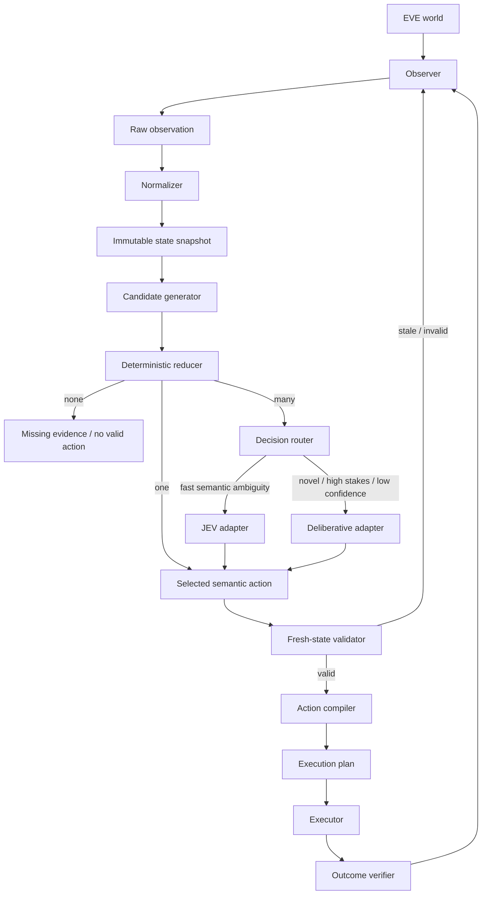
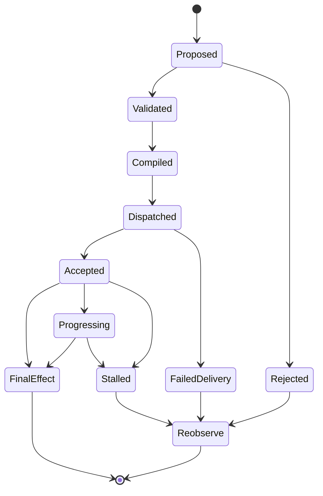

# JEVe Architecture

This document is the normative architecture description for JEVe.

JEVe separates three concerns that are often incorrectly collapsed into one agent:

1. **state interpretation and mechanical decision reduction**;
2. **bounded semantic choice**;
3. **validated physical execution**.

The architecture is designed so that changing the JEV implementation, the EVE observation source, or the input mechanism does not require rewriting the decision model.

## 1. Architectural objective

The objective is not to maximize model usage. It is to minimize the amount of state that requires probabilistic reasoning while retaining good decisions under uncertainty.

The desired control shape is:

```text
observation
  -> normalized state
  -> valid semantic candidates
  -> deterministic reduction
  -> bounded semantic decision when required
  -> fresh-state validation
  -> execution planning
  -> bounded physical action
  -> observed outcome
```

The system must preserve the following invariant:

> **No probabilistic decision creates physical authority.**

A model can select from semantic alternatives. A separate deterministic layer decides whether that selection is still valid and how, or whether, it may be executed.

## 2. Component model



### 2.1 Observer

The Observer acquires evidence about the current EVE state.

It owns acquisition, not interpretation. An observer may read structured client state, an accessibility tree, a screen-derived representation, logs, or a simulator. The architecture does not require one particular source.

Observer output should carry provenance and freshness information whenever possible.

### 2.2 Normalizer

The Normalizer converts source-specific observations into a stable domain representation.

Responsibilities:

- canonical identifiers where available;
- units and coordinate normalization;
- explicit uncertainty;
- timestamps and observation epoch;
- source provenance;
- derived values that are deterministic and cheap;
- rejection of malformed or internally contradictory observations.

The Normalizer must not silently invent missing facts.

### 2.3 Immutable state snapshot

A decision operates on a snapshot rather than a mutable bag of live values.

A snapshot must have at least:

```text
snapshot_id
observation_epoch
observed_at
freshness_deadline or freshness policy
facts
objectives
constraints
provenance summary
```

The implementation may use persistent/immutable structures or normal objects treated as immutable by contract.

### 2.4 Candidate generator

The Candidate Generator creates the complete set of semantic actions currently authorized by domain rules.

It answers:

> "What actions are worth considering?"

It does not answer:

> "Which action should be taken?"

Candidate generation should be deterministic whenever possible. Candidates must be typed and parameterized by stable semantic identifiers, not screen coordinates.

Example:

```text
WAIT
CONTINUE_ROUTE(route_id)
DOCK(station_id)
RETREAT(destination_id)
ENGAGE_TARGET(entity_id)
```

### 2.5 Deterministic reducer

The Deterministic Reducer removes candidates that can be rejected without semantic judgment.

Typical reducers include:

- precondition failure;
- hard safety constraints;
- impossible or unavailable actions;
- exact resource/capacity limits;
- deadline constraints;
- route reachability;
- known state-machine constraints;
- strict dominance where one option is no worse on every declared deterministic objective and better on at least one;
- policy rules explicitly configured by the operator.

A reducer must be explainable by a stable reason code.

If one candidate remains, the system should not call JEV.

If none remain, the correct result is not to improvise. The system should request more evidence, wait, escalate, or fail closed according to policy.

### 2.6 Decision router

The Decision Router determines which reasoning tier owns the remaining ambiguity.

It should consider:

```text
candidate_count
state freshness
stakes
novelty
latency budget
available context quality
confidence requirements
recent decision stability
```

The router is deterministic policy. The reasoning model does not decide whether it is sufficiently trustworthy to receive authority.

### 2.7 JEV adapter

The JEV Adapter receives a small structured decision problem and returns a bounded semantic result.

The adapter is provider-specific; the core architecture is not.

The request should contain only the context required to distinguish the remaining candidates. The response must be validated against the request.

The JEV result must not introduce an action that was not in the candidate set.

### 2.8 Deliberative adapter

The Deliberative Adapter is optional for an MVP but is an explicit architectural boundary.

It is used for cases such as:

- generating a new multi-step plan;
- resolving conflicting objectives;
- decisions whose consequences are high relative to uncertainty;
- novel states outside the fast-path distribution;
- deciding which additional observation would reduce uncertainty.

It must still return through the same semantic-action and validation boundary.

### 2.9 Fresh-state validator

The validator is the authority boundary between thought and action.

Before action compilation it must verify, at minimum:

- the selected action existed in the candidate set;
- action parameters are well formed;
- required preconditions still hold;
- relevant evidence is still fresh;
- the observation epoch is compatible;
- no higher-priority inhibit/safety condition appeared;
- no equivalent action is already pending when duplicates would be harmful.

If validation fails, re-observe. Do not patch the stale decision in place using guessed current state.

### 2.10 Action compiler

The Action Compiler converts a semantic action into an implementation-specific `ExecutionPlan`.

This is deliberately separated from semantic choice.

For example:

```text
DOCK(station_id)
```

may become:

```text
1. resolve station_id in the current observation epoch
2. establish required current selection state
3. issue the smallest bounded command
4. observe command acceptance
5. observe progress if applicable
6. observe final docked state
```

The compiler may fail if the semantic objective cannot currently be mapped safely to physical controls.

### 2.11 Executor

The Executor performs already-authorized physical operations. It does not perform semantic planning.

The executor must accept a bounded `ExecutionPlan`, report delivery outcome, and avoid hidden fallback to unrelated mechanisms.

For an initial MVP, the executor should be a simulator or test double. Real client integration is not required to prove the architecture.

### 2.12 Outcome verifier

An issued input is not proof that the intended result occurred.

Where observable, JEVe separates:

```text
COMMAND_ACCEPTED
PROGRESSING
FINAL_EFFECT
```

Examples:

- input delivery is not necessarily command acceptance;
- a UI transition is not necessarily the intended final game state;
- generic state change is not necessarily progress toward the selected objective.

The verifier converts new observation into semantic outcome evidence.

## 3. State semantics

### 3.1 Explicit knowledge state

Boolean-looking facts should support more than two values when observation can be incomplete:

```text
KNOWN_TRUE
KNOWN_FALSE
UNKNOWN
STALE
TRANSITIONAL
```

These states have different meanings:

- `KNOWN_TRUE`: positively observed or deterministically proven true;
- `KNOWN_FALSE`: positively observed or deterministically proven false;
- `UNKNOWN`: current evidence cannot establish either side;
- `STALE`: a formerly known value has exceeded its validity window;
- `TRANSITIONAL`: the world is expected to be reconstructing and temporary absence is not stable evidence.

Reducers must state which knowledge values they accept.

### 3.2 Observation epoch

An observation epoch identifies a coherent observation world.

The epoch should advance when previously resolved physical/UI references must be invalidated as a class, for example after a major session or interface reconstruction.

A coordinate, node, window object, or equivalent physical reference must never outlive the epoch in which it was resolved unless the implementation can independently prove continued validity.

A semantic identifier may survive an epoch. A physical reference generally should not.

### 3.3 State epoch vs observation epoch

Implementations may additionally track a `state_epoch` that increments for meaningful normalized state changes within one coherent observation world.

The distinction is useful:

```text
observation_epoch: invalidates physical evidence classes
state_epoch: marks ordinary normalized world-state change
```

A decision may permit some state-epoch movement if its preconditions are revalidated, while an observation-epoch change should normally force physical re-resolution.

## 4. Decision contracts

The core decision relationship is:

```text
DecisionRequest(snapshot, objective, candidates, compact_features)
    -> DecisionResponse(selected_candidate, confidence, optional_ranking, rationale_tags)
```

Normative requirements:

1. `selected_candidate` MUST reference an input candidate identifier.
2. Missing or malformed candidate references MUST fail validation.
3. Confidence is advisory routing evidence, not physical authority.
4. A response MUST carry enough correlation data to bind it to the originating snapshot/request.
5. A response that arrives after its freshness budget expires MUST be revalidated or discarded.
6. The core implementation MUST be able to replace the JEV adapter with a deterministic test double.

## 5. Decision routing

### 5.1 Fast path

The preferred hot path is:

```text
observe -> normalize -> reduce -> one candidate -> validate -> execute
```

This avoids model latency entirely.

The JEV hot path is:

```text
observe -> normalize -> reduce -> small candidate set -> JEV -> validate -> execute
```

The slow path is:

```text
observe -> normalize -> reduce -> ambiguity classified as high-risk/novel -> deliberate -> validate -> execute
```

### 5.2 Confidence and margin

When the adapter can provide scores, confidence alone is insufficient.

A useful ambiguity signal is:

```text
margin = score(best) - score(second_best)
```

A result such as `0.51 / 0.49` should normally be treated differently from `0.96 / 0.04`, even though both select the same top candidate.

Thresholds belong to the routing policy and should depend on consequence/stakes.

### 5.3 Novelty

Novelty should be explicit rather than inferred from confidence alone.

Possible novelty signals include:

- missing expected feature groups;
- unseen categorical values;
- state combinations absent from replay fixtures;
- candidate types not previously encountered together;
- repeated disagreement between JEV choice and deterministic post-validation;
- unstable flip-flopping between decisions in equivalent states.

Novelty can route to more observation, deliberation, or fail-closed behavior.

## 6. Execution lifecycle

A state-changing semantic action should have a lifecycle similar to:



Retries, if supported, belong to explicit action-specific policy. A generic infinite retry mechanism is outside the architecture.

## 7. Concurrency model

The simplest correct MVP uses one logical decision transaction per controlled client/context.

Passive observation may run continuously, but state-changing execution should be serialized unless an implementation can prove two actions commute safely.

A useful default invariant is:

> At most one unresolved state-changing intent may own a given semantic resource at a time.

Examples of semantic resources might be `navigation`, `target-selection`, or `docking`. The actual resource taxonomy is domain-specific.

## 8. Performance model

JEVe should optimize the full decision loop rather than model latency in isolation.

Measure at least:

```text
observation latency
normalization latency
candidate-generation latency
reduction latency
routing latency
JEV latency when invoked
validation latency
compilation latency
execution-delivery latency
verification latency
end-to-end decision-to-effect latency
```

High-rate passive cognition should not imply high-rate physical mutation.

Recommended optimizations:

- precompute static rule tables;
- cache deterministic derived features by snapshot/epoch;
- use compact candidate-local features;
- avoid serializing large raw observation trees into model prompts;
- parallelize independent read-only feature calculations;
- cancel model work when the originating decision becomes stale;
- deduplicate equivalent pending decisions;
- log enough data to replay decision behavior offline.

## 9. Promotion of learned judgment into deterministic rules

A repeated JEV decision should not automatically become a hard-coded rule.

Promotion requires an independently stated invariant.

A safe workflow is:

```text
repeated decision pattern
  -> collect replay evidence
  -> hypothesize deterministic invariant
  -> encode rule separately
  -> verify against positive and adversarial fixtures
  -> compare against prior JEV behavior
  -> enable rule with explicit reason code
```

The goal is to lower cost and latency without silently freezing a correlation as if it were a rule.

## 10. Traceability

Every decision transaction should be reconstructable from a trace containing at least:

```text
request_id
snapshot_id
observation_epoch
objective
candidate_ids
reduction reasons
route chosen
model adapter used, if any
selected candidate
confidence/margin if available
validation result
execution-plan id
outcome state
latency breakdown
```

Raw sensitive or unstable source data need not be retained if normalized evidence is sufficient for replay.

## 11. Architectural invariants summary

The following are normative:

1. Mechanical decisions are resolved mechanically when sufficient evidence exists.
2. JEV receives a closed semantic candidate set on the normal fast path.
3. JEV cannot directly dispatch physical input.
4. `UNKNOWN` is not `false`.
5. State-changing decisions are revalidated against fresh state.
6. Physical references are invalidated when their observation epoch becomes obsolete.
7. Input delivery is not final-effect proof.
8. Equivalent pending actions are not blindly re-issued.
9. Provider-specific JEV and executor details live behind adapters.
10. Replayability is part of the design, not an afterthought.
11. External implementations may vary, but must preserve these semantic boundaries to call themselves JEVe-compatible.
